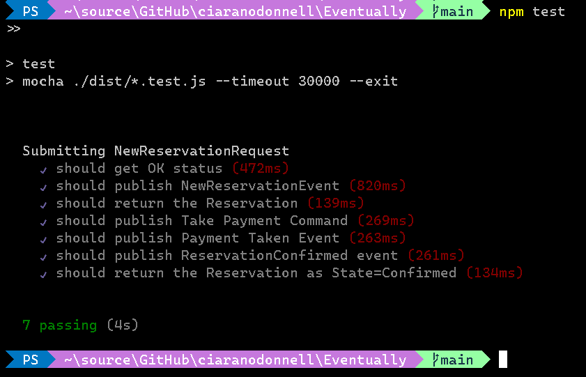

# Event To End Event Testing

The purpose of this library is to serve as a demonstration of how to run end to end tests for Event Driven Systems.

When creating web applications that have asynchronous backend systems it can be very challenging to test those backends.
In an e-commerce example: It would be useful to test that putting a new Order into the Order Service causes:
   
1. Order Service generates a ```NewOrderReceived``` event.
2. Order Service API returns Order status as *'Received'*
3. Order Service issues ```TakePayment``` command from Payment Service
4. Payment Service issues ```Payment Taken Event```
5. Order Service issues an ```OrderComplete``` event


## Example of use of this library:

This library uses Mocha to run these tests like unit tests. Example code:
``` typescript
 describe('Submitting NewReservationRequest', async () => {
    var test : ASBTest;
    var demoTopicSub : Subscription;
    
    before(async () => {
        // runs once before the first test in this block
        
        //Create a Service Bus connection for this test
        test = new ASBTest(
            process.env.SERVICEBUS_CONNECTION_STRING ?? "",
            new MassTransitMessageEncoder()
            );
        
        //Subscribe to the topic first so we dont miss the messages
        demoTopicSub = await test.subscribeToTopic("NewReservationReceived");
    });
    
    it('should get OK status', async () => {    

        console.log("About to call API");
        //post out initial request to the service
        var svcResponse = await postToService("https://requestbin.io/rz1jx5rz", 
                { RequestCorrelationId : test.testUniqueId,
                    ReservationId:1,
                    StartDate : moment().format('YYYY-MM-DD HH:m:s'),
                    EndDate:  moment().format('YYYY-MM-DD HH:m:s'),
                    GuestId : 123
                } );
        console.log("API Response : " + svcResponse);

        //cheeck we got a success response
        expect(svcResponse).to.equal(true);
    });

    it('should publish NewReservationEvent', async () => {    
        //wait up to 2 seconds for a message from our service
        var receivedMessage = await demoTopicSub.waitForMessage(2000);
        //check we received the event
        expect(receivedMessage.didReceive).to.equal(true);
    });

    //Clean Up
    after(async ()=>{
        //call function to delete all the temporary subscriptions
        test.cleanup();
    });
});
```

## Example output:


### Passing Tests:



### Failing Test


